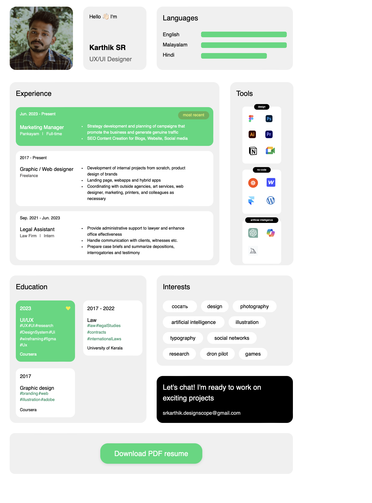

# Вступительный экзамен для Front-end разработчика



Интерактивное резюме с возможностью редактирования контента и экспортом в PDF. Проект создан с использованием Vite для максимальной производительности.

# ✨ Основные функции

- ✏️ **Редактирование на лету** - кликайте на любой текст для изменения
- 📄 **Экспорт в PDF** - сохраняет все стили и оформление
- 🌊 **Эффекты Material Design** - ripple-анимации при кликах
- 📱 **Адаптивный дизайн** - корректное отображение на любых устройствах
- ⚡ **Быстрая загрузка** - благодаря оптимизациям Vite

# 🛠 Стек технологий

- **Vite** - сборка проекта
- **Vanilla JavaScript** - без использования фреймворков
- **CSS3** - Flexbox, Grid, анимации
- **HTML5** - семантическая верстка
- [html2pdf.js](https://github.com/eKoopmans/html2pdf.js) - генерация PDF

# 🚀 Запуск и разработка


## Установка зависимостей
```bash
npm install
```
## или
```bash
yarn install
```

## Запуск dev-сервера
```bash
npm run dev
```
### или
```bash
yarn dev
```

## Production сборка
```bash
npm run build
```
### или
```bash
yarn build
```


## Просмотр production-сборки
```bash
npm run preview
```
### или
```bash
yarn preview
```


# 🌐 Демо

 - [Посмотреть онлайн на GitHub Pages](https://sergiomartinov31.github.io/front-end-entrance-exam/)


# 🔍 Проверка качества кода
- HTML: Проверен через W3C Validator
- JavaScript: Проанализирован с помощью JSHint
- Форматирование: Единый стиль через Prettier